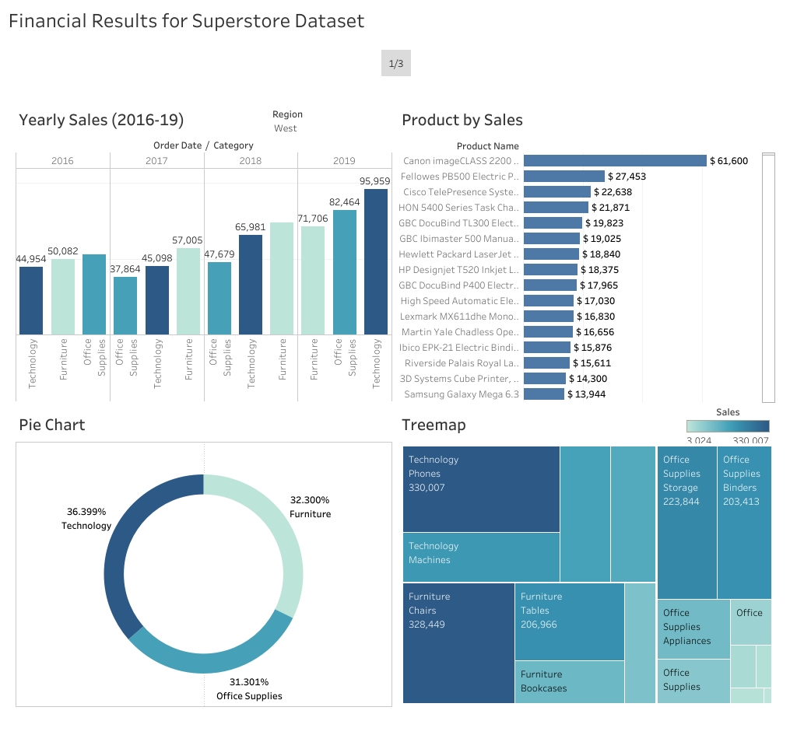

# 📊 Basic Tableau – Data Analysis Series

Welcome to the **"Basic Tableau"** project – part of my ongoing **Data Analysis Series**. This project demonstrates fundamental Tableau features and visualization techniques using the **Superstore dataset**.

It includes a comprehensive set of **individual sheets**, **dashboards**, and a **story** to showcase how data can be explored, analyzed, and presented using Tableau.

---

## 🧰 Tools Used

- **Tableau Desktop**
- **Superstore Dataset** 

---

## 📁 Project Contents

### 📄 Sheets

Each sheet in this project is designed to demonstrate a key Tableau concept or visualization technique. Below is a breakdown of all individual sheets:

1. **Histogram (Order Date by Category)**  
   A traditional histogram showing the distribution of orders over time, categorized by product category. Helps in identifying seasonal trends, periods of high/low activity, and sales concentration.

2. **Horizontal Histogram (Product by Sales)**  
   A bar chart displaying individual products on the vertical axis and their corresponding sales values horizontally. Useful for quickly spotting best-selling and low-performing products.

3. **Treemap (Category by Sales)**  
   A space-efficient visual that uses nested rectangles to represent sales distribution across categories. The size and color intensity of each rectangle provide insights into relative performance.

4. **Packed Bubble Chart (Category & Sub-Category by Sales)**  
   Circles (bubbles) represent combinations of categories and sub-categories, with their size indicating total sales. Great for visual storytelling and identifying clusters of high or low sales.

5. **Highlighted Chart**  
   This sheet emphasizes specific data points using interactive highlighting. When a user selects a category or sub-category, the rest of the data is dimmed, helping focus on a particular group.

6. **Pie Chart**  
   A classic pie chart to show the proportion of sales contributed by each product category. Although simple, it’s useful for representing percentage shares and relative comparisons.

7. **Sorting Techniques**  
   Demonstrates various ways to sort data in Tableau — ascending, descending, manual sorting, and sort by calculated fields. Essential for organizing data meaningfully in visualizations.

8. **Chart Layout Options**  
   A comparison of different chart layouts such as side-by-side, stacked, and overlapping visuals. This sheet helps understand how layout choices affect clarity and readability.

9. **Chart Axes**  
   Explains how Tableau manages axes — including fixed and dynamic ranges, synchronized dual axes, and axis formatting. Important for ensuring consistent scaling across visuals.

10. **Combined Axis**  
   Combines multiple measures (like Sales and Profit) onto a single axis. This enables direct visual comparison and reduces clutter, especially when analyzing trends between related metrics.

11. **Dual Axis Chart**  
   Plots two different measures (e.g., Sales and Quantity) using two vertical axes on the same chart. Useful for comparing metrics with different scales while maintaining data integrity.

12. **General Filters**  
   Applies basic filters like category, region, and date to slice the data. This sheet shows how filters refine results and allow users to explore subsets of data dynamically.

13. **Top/Bottom Filters**  
   Demonstrates how to filter and display only the top N or bottom N items (e.g., top 10 products by sales). Useful for narrowing down the most significant contributors or outliers.

14. **Numerical Functions**  
   Utilizes Tableau’s built-in numerical functions like SUM, AVG, MIN, and MAX to perform calculations on the dataset. These are foundational to any quantitative analysis.

15. **Parameters**  
   Showcases Tableau parameters — dynamic input controls that allow users to interact with the dashboard for a customizable experience.

---

### 📊 Dashboards

Three dashboards combining multiple sheets to present data in an interactive and user-friendly layout.

---

### 📖 Story

A final **Tableau Story** that walks viewers through the dashboards and key insights, tying everything together in a narrative format.

---

## 🖼️ Preview

  

---

## 📦 How to Use

1. **Download** the `.twbx` file from this repository.
2. Open the file in **Tableau Desktop** or [Tableau Public](https://public.tableau.com).
3. Explore the sheets, dashboards, and story tabs.

---

## 📌 Objective

This project is designed to:
- Demonstrate basic Tableau visualizations
- Practice core Tableau features
- Share interactive insights using a standard business dataset

---

## 🌐 Tableau Public Version 

[🔗 View on Tableau Public]([https://public.tableau.com/your-link](https://public.tableau.com/app/profile/hashir.khan1870/viz/BasicTableau_17482653005110/Story1))

 Let's Connect!!

